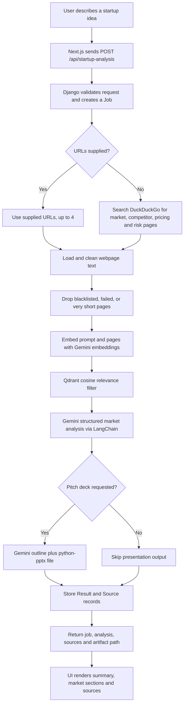

# EVA - AI-Powered Startup Analyzer

EVA is a full-stack startup idea research application. A founder describes an
idea, and the platform searches for relevant public web pages, extracts useful
content, removes low-relevance sources with vector similarity, and asks a
generative AI model to produce a structured market analysis. The result is shown
in a web dashboard and can optionally include a generated PowerPoint pitch deck.

The product is presented in the UI as **Startup Analyzer**. It is useful for
early validation questions such as:

- What problem and target segments does this idea address?
- Which competitors or alternatives appear in researched sources?
- What pricing signals, moats, and risks are visible?
- What could an initial pitch-deck narrative look like?

## What The Application Does

The application has two main parts:

| Part              | Purpose                                                                                                        |
| ----------------- | -------------------------------------------------------------------------------------------------------------- |
| `client/`         | Public-facing Next.js site with landing, about, pricing, API docs, idea analyzer, and detailed analysis pages. |
| `server/scopeAi/` | Django REST API that executes the research and AI pipeline, stores jobs/results, and creates pitch-deck files. |

From the browser, a user enters a startup idea on `/analyze`. The frontend posts
the prompt to `POST /api/startup-analysis`, displays the returned summary, then
passes the full response through `sessionStorage` to `/full-analysis` for the
market and source views.

The API can also be used directly. Direct callers may provide a curated list of
URLs rather than relying on automatic web search, and may disable PowerPoint
generation.

## Tech Stack

### Frontend

| Technology                 | Role                                         |
| -------------------------- | -------------------------------------------- |
| Next.js 16 with App Router | Web application routing and rendering        |
| React 19                   | Component UI and client-side interaction     |
| Tailwind CSS 4             | Styling, responsive layout, and visual theme |
| Framer Motion              | Page and component animations                |
| Lucide React               | Icons                                        |

Available frontend routes include:

| Route            | Purpose                                                  |
| ---------------- | -------------------------------------------------------- |
| `/`              | Landing page and platform overview                       |
| `/analyze`       | Startup idea input and initial summary result            |
| `/full-analysis` | Detailed summary, market analysis, and source references |
| `/about`         | Product story and feature explanation                    |
| `/pricing`       | Pricing presentation page                                |
| `/api-docs`      | API quick-start information                              |
| `/contact`       | Contact and support UI                                   |

### Backend And Infrastructure

| Technology                   | Role                                                            |
| ---------------------------- | --------------------------------------------------------------- |
| Python / Django 5.2          | Server framework, configuration, persistence, and media hosting |
| Django REST Framework        | JSON request validation and API response serialization          |
| SQLite by default            | Stores analysis jobs, source metadata, and structured results   |
| `dj-database-url`            | Supports replacing SQLite through `DATABASE_URL`                |
| Qdrant 1.18                  | Temporary vector collections for source relevance validation    |
| DuckDuckGo `ddgs`            | No-key web search when request URLs are not supplied            |
| LangChain WebBaseLoader      | Fetches source page content                                     |
| Readability + Beautiful Soup | Converts fetched content into readable text                     |
| `python-pptx`                | Writes generated pitch outlines into `.pptx` files              |
| Docker Compose               | Runs the API and Qdrant together                                |
| Gunicorn + WhiteNoise        | Container production server and static file delivery            |

## AI Technology Used

EVA does not ask a model to answer from the startup prompt alone. For the
analysis response, it builds a small research context first, then generates a
structured answer from the selected sources.

| AI Capability     | Implementation                                                    | Purpose                                                                          |
| ----------------- | ----------------------------------------------------------------- | -------------------------------------------------------------------------------- |
| Language model    | Google Gemini `gemini-2.5-flash` through `ChatGoogleGenerativeAI` | Produces the market analysis and pitch-deck outline                              |
| AI orchestration  | LangChain                                                         | Builds prompts, invokes Gemini, and requests structured model output             |
| Embeddings        | Google `models/gemini-embedding-2`                                | Represents the idea and source pages as semantic vectors                         |
| Vector validation | Qdrant with 3072-dimensional cosine vectors                       | Keeps scraped pages whose meaning is sufficiently close to the idea              |
| Output schema     | Pydantic models                                                   | Constrains generated analysis and deck outline into application-ready structures |

### How Source Relevance Works

For each analysis request, the server creates a uniquely named, temporary Qdrant
collection. It embeds the user's prompt and the first 4,000 characters of each
scraped page with `gemini-embedding-2`, then queries for pages with a cosine
similarity score of at least `0.5`. Only the matching pages go into the analysis
prompt. The temporary collection is deleted at the end of the request, so
research content is not kept as a long-lived vector knowledge base.

If Qdrant validation encounters an exception, the current implementation falls
back to the pages already extracted rather than failing the entire analysis.

## End-To-End Flow



### Pipeline Details

1. **Request and job creation**: Django REST Framework validates `prompt`,
   optional `urls`, and optional `include_pptx`. A `Job` record begins in
   `RUNNING` state.
2. **Source collection**: The backend accepts at most four provided URLs. If
   none are supplied, it runs a DuckDuckGo search based on the idea plus market,
   competitor, pricing, and risk terms.
3. **Extraction**: `WebBaseLoader` fetches pages. Social or scraper-unfriendly
   domains on the blacklist are skipped. Pages under 50 words are skipped, and
   accepted page text is capped at 12,000 characters.
4. **Semantic filtering**: Gemini embeddings and Qdrant filter candidate pages
   against the idea before generation.
5. **Analysis generation**: The accepted source text, capped to 15,000
   characters in the combined prompt, is processed by Gemini with temperature
   `0`. LangChain/Pydantic structure the result into a summary, competitors, and
   market fields: problems, target segments, pricing signals, moats, and risks.
6. **Pitch-deck generation**: When enabled, a second Gemini call creates a
   concise pitch outline from the original idea. `python-pptx` turns it into a
   presentation under `media/pitch/`.
7. **Persistence and display**: Django saves the job, retained source previews,
   result JSON, model name, and optional deck path. The client renders the
   returned information.

## API

### Endpoint

```http
POST /api/startup-analysis
Content-Type: application/json
```

### Request Body

| Field          | Type         | Required | Description                                                             |
| -------------- | ------------ | -------- | ----------------------------------------------------------------------- |
| `prompt`       | string       | Yes      | Description of the startup idea to investigate                          |
| `urls`         | string array | No       | Source URLs to analyze instead of running search; at most four are used |
| `include_pptx` | boolean      | No       | Whether to create a pitch deck; defaults to `true`                      |

Example:

```bash
curl -X POST http://127.0.0.1:8000/api/startup-analysis \
  -H "Content-Type: application/json" \
  -d '{
    "prompt": "An AI assistant that helps small restaurants reduce food waste",
    "include_pptx": false
  }'
```

### Response Shape

```json
{
  "id": "job-uuid",
  "prompt": "An AI assistant that helps small restaurants reduce food waste",
  "include_pptx": false,
  "status": "DONE",
  "error": null,
  "sources": [
    {
      "url": "https://example.com/article",
      "title": "Source title",
      "snippet": "Extracted preview..."
    }
  ],
  "result": {
    "summary": "Executive summary generated from retained sources...",
    "facts": [],
    "competitors": ["Example competitor"],
    "market": {
      "problem": ["..."],
      "target_segments": ["..."],
      "pricing_signals": ["..."],
      "moats": ["..."],
      "risks": ["..."]
    },
    "report_md_path": null,
    "pptx_path": null,
    "model_name": "gemini-2.5-flash",
    "generated_at": "..."
  }
}
```

The `facts` and `report_md_path` properties exist in the stored response schema,
but the current pipeline does not populate them. When a presentation is
generated, `pptx_path` is a path relative to the backend media directory, for
example `pitch/deck_ab12cd34.pptx`.

## Project Structure

```text
scopeAi/
|-- client/
|   |-- src/app/                 # Next.js routes and global styles
|   |-- src/components/          # Page sections and analyzer result UI
|   `-- package.json
|-- server/
|   |-- docker-compose.yml       # Django API plus Qdrant services
|   `-- scopeAi/
|       |-- api/                 # REST endpoint, serializers, and database models
|       |-- services/            # Search, extraction, validation, AI, and PPTX pipeline
|       |-- scopeAi/             # Django settings and URL configuration
|       |-- .env.example
|       |-- Dockerfile
|       |-- manage.py
|       `-- requirements.txt
`-- README.md
```

## Getting Started

### Prerequisites

- Node.js and npm for the Next.js frontend
- Python 3.13 recommended for local backend development, matching the Docker image
- Docker Desktop or another Docker runtime for Qdrant and the container setup
- A Google AI Studio Gemini API key

### Option 1: Run The Backend With Docker Compose

1. Configure backend environment values:

   ```bash
   cd server/scopeAi
   cp .env.example .env
   ```

   Edit `.env` and set at least `GEMINI_API_KEY` and `DJANGO_SECRET_KEY`. For
   local frontend access, use:

   ```dotenv
   DJANGO_ALLOWED_HOSTS=localhost,127.0.0.1
   CORS_ALLOWED_ORIGINS=http://localhost:3000
   ```

2. Build and start Django and Qdrant:

   ```bash
   cd ..
   docker compose up --build
   ```

   The API is available at `http://127.0.0.1:8000`. Docker Compose persists the
   SQLite database, generated media, static output, and Qdrant storage in named
   volumes.

### Option 2: Run The Backend Locally

Run Qdrant in Docker:

```bash
docker run --name scopeai-qdrant -p 6333:6333 qdrant/qdrant:v1.18.0
```

In a separate terminal:

```bash
cd server/scopeAi
cp .env.example .env
python -m venv .venv
source .venv/bin/activate
python -m pip install -r requirements.txt
python manage.py migrate
python manage.py runserver
```

For local development, set these additional values in `server/scopeAi/.env`:

```dotenv
DJANGO_DEBUG=True
DJANGO_ALLOWED_HOSTS=localhost,127.0.0.1
CORS_ALLOWED_ORIGINS=http://localhost:3000
QDRANT_URL=http://localhost:6333
```

### Run The Frontend

Create `client/.env.local`:

```dotenv
NEXT_PUBLIC_API_URL=http://127.0.0.1:8000
```

Then start Next.js:

```bash
cd client
npm install
npm run dev
```

Open `http://localhost:3000/analyze` and submit a startup idea.

## Configuration

Important backend environment variables are defined in
`server/scopeAi/.env.example`:

| Variable               | Purpose                                                 |
| ---------------------- | ------------------------------------------------------- |
| `GEMINI_API_KEY`       | Required for Gemini generation and embedding requests   |
| `DJANGO_SECRET_KEY`    | Required Django signing secret                          |
| `DJANGO_DEBUG`         | Enables debug behavior when `True`                      |
| `DJANGO_ALLOWED_HOSTS` | Comma-separated permitted API hosts                     |
| `CORS_ALLOWED_ORIGINS` | Origins permitted to call the API from a browser        |
| `CSRF_TRUSTED_ORIGINS` | Trusted origins for deployed API access                 |
| `QDRANT_URL`           | Qdrant service URL; defaults to `http://localhost:6333` |
| `DATABASE_URL`         | Optional database connection; defaults to local SQLite  |
| `MEDIA_ROOT`           | Location where generated presentations are saved        |
| `DJANGO_SERVE_MEDIA`   | Whether Django exposes generated media files            |

The frontend needs:

| Variable              | Purpose                           |
| --------------------- | --------------------------------- |
| `NEXT_PUBLIC_API_URL` | Public base URL of the Django API |

## Data Stored By The Backend

| Model    | Stored Data                                                                |
| -------- | -------------------------------------------------------------------------- |
| `Job`    | User prompt, supplied URLs, deck preference, processing status, and errors |
| `Source` | URLs retained after processing, titles, and short extracted snippets       |
| `Result` | Summary, competitor list, market JSON, model name, and artifact paths      |

The source texts used during generation are not saved in full in the database;
only snippets are stored. Qdrant collections are temporary per request and are
deleted after relevance filtering.

## Current Implementation Notes

- The browser analyzer sends only the prompt, so it uses automatic search and
  the API default of generating a pitch deck. Supplying URLs or disabling deck
  generation is currently available through the API.
- Generated presentations are recorded in the API result. The current frontend
  does not yet expose a download button for the `.pptx` artifact.
- Analysis is synchronous: the API response returns after scraping, embedding,
  generation, persistence, and optional presentation generation finish.
- Automated test modules are present as placeholders, but no application test
  coverage is currently implemented.
